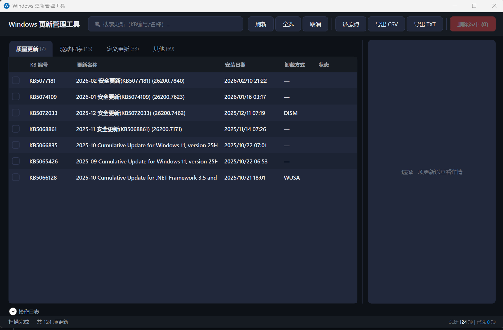

# WinUpdateManager

一个用于查看、管理和卸载 Windows 更新的桌面工具。

## 功能

- 查看所有已安装的 Windows 更新（质量更新、驱动程序、定义更新等）
- 通过 DISM / WUSA / PnPUtil 卸载指定更新
- 自动匹配最佳卸载方式，支持 Win11 累积更新的 CBS 注册表包名匹配
- 批量选择和删除
- 创建系统还原点（操作前备份）
- 导出更新列表为 CSV / TXT
- 搜索筛选

## 截图



## 技术细节

- .NET 10 / WPF，MVVM 架构
- 通过 Windows Update Agent COM 接口查询更新历史
- 通过 CBS 注册表 + DISM 命令行匹配累积更新包名（解决 WUA 版本号与 DISM 包名不一致的问题）
- 通过 PnPUtil 枚举和卸载第三方驱动更新
- 需要管理员权限运行

## 系统要求

- Windows 10 / 11
- .NET 10 Runtime
- 管理员权限

## 构建

```bash
dotnet build -c Release
```

输出位于 `WinUpdateManager/bin/Release/net10.0-windows/`。

## 使用说明

1. 以管理员身份运行 `WinUpdateManager.exe`
2. 程序启动后自动扫描所有已安装更新
3. 在列表中勾选要卸载的更新，点击「删除选中」
4. 建议操作前先点击「还原点」创建系统还原点

### 卸载方式说明

| 方式 | 适用范围 |
|------|---------|
| DISM | 累积更新、安全更新（通过 CBS 包名匹配） |
| WUSA | 独立更新包（含 KB 编号的非累积更新） |
| PnPUtil | 第三方驱动程序更新 |

对于已被更新版本取代的旧累积更新，卸载方式显示为 `—`，表示无法单独卸载。

## 已知限制

- 更新历史记录是日志性质的，卸载更新后历史条目不会消失
- 部分系统组件更新无法卸载（Windows 设计限制）
- 卸载累积更新会同时回退到上一个累积更新的版本

## License

MIT
